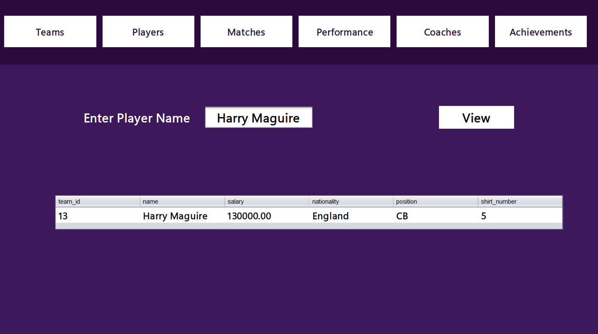
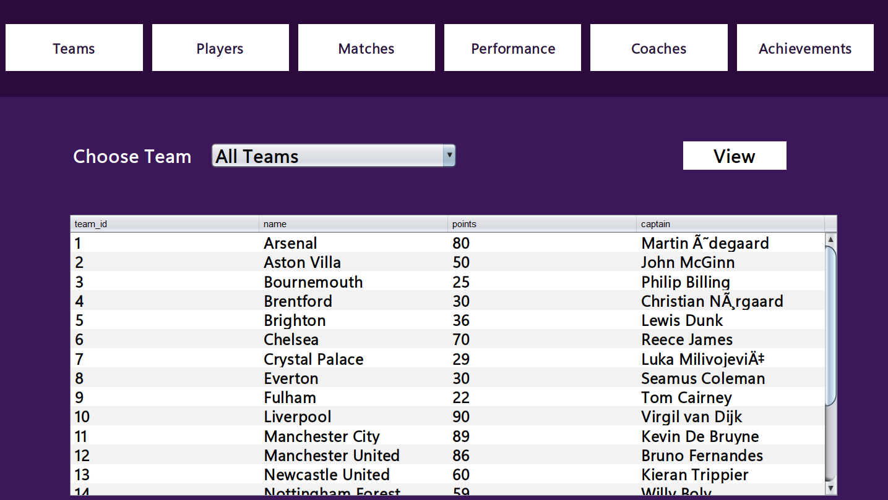

# League Management System

A database-driven desktop application for managing Football leagues. Handles teams, matches, players, stadiums, and officials through an admin dashboard that provides full CRUD operations.

## Features
#### Full CRUD operations
- Add / Remove Teams and Players
- Read all entities data
- Log new match record
- Modify and fix erronous records
#### Admin Authentication
#### Provides data about teams, players, matches, performance, referees, stadiums, coaches and presidents
#### Tracks teams info, their match results and current points
#### Tracks Players Performance and Statistics
#### Calculate Teams Standings
## Database
### Conceptual Design | ERD

### Logical Design | Schema

## Application Screenshots

